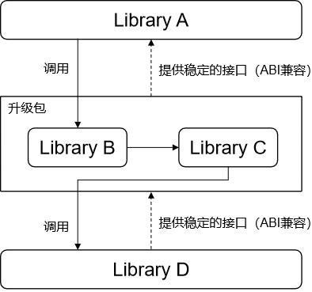
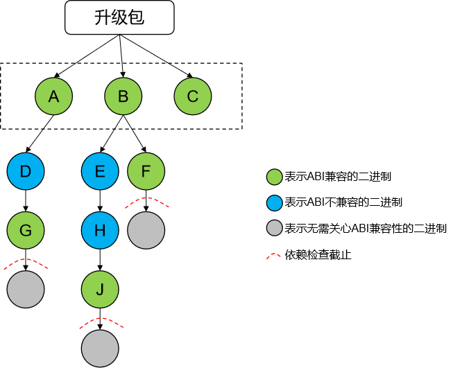

# 模块升级概述

## 模块升级简介

模块化升级主要向OEM厂家的系统开发者提供。模块是指SDK public API层以下的系统服务或库，而非传统应用包。
模块化升级允许系统开发者在满足依赖接口ABI（Application Binary Interface）稳定的前提下，将系统按模块、服务、或库进行解耦，实现独立打包、独立升级的能力。模块化升级可解决系统的模块解耦，各模块可独立于OTA版本进行发布和演进。

## 模块升级基本概念

- ABI（Application Binary Interface）稳定性

  ABI稳定性指应用二进制接口稳定性，为了保证模块能独立升级，升级模块对OS其他模块依赖的接口和对其他模块提供的接口要保证稳定，防止模块独立升级后，因为接口兼容性问题导致运行异常。


- 模块包

  模块包是升级包的最小单位，包含独立升级的SystemAbility服务或系统库。


- HMP（Harmony Module Package）包

  为了便于模块包的批量打包和升级发布，对若干模块包进行组合打包和管理，统称为HMP包。HMP所包含的模块包范围由具体业务决定，是一个独立升级模块的集合。


- 安全校验

  模块包主要包含两重校验，一个是模块包要满足升级包本身签名校验，只有校验通过才允许安装；另一个是模块包中的image镜像，该镜像通过[HVB](https://gitee.com/openharmony/startup_hvb/blob/master/README_zh.md)（OpenHarmony Verified Boot）机制进行校验，保证模块包要满足HVB校验后才能挂载运行。

## 实现原理

模块包的制作包含模块定义和模块打包两部分：

1. 通过统一的编译模板（gn模板），定义模块包所包含的基本二进制，以及相关模块基本配置属性（config.json），公私钥定义和签名证书（仅示例，实际产品化时，需要替换为产品化签名密钥对和证书）。通过stable关键词标记，定义依赖接口的ABI稳定性。
2. 模块打包分为单模块包和多个模块包二次打包的HMP包。单模块包是能够升级的最小单位，为了OEM厂家在一次升级过程中能够管理多个模块，系统支持多个模块包统一打包发布。
  模块包涉及到的需要保证ABI兼容的二进制，通过ABI校验工具，生成相关二进制的ABI信息文件作为基线，并归档到特定仓。每次模块包编译时，实时生成对应二进制的ABI信息文件，并与基线对比，不一致则编译失败。防止在一个OS大版本内相关的二进制的ABI发生变化，从而导致系统异常。

## 约束与限制

1. 当前模块升级能力仅支持SystemAbility的升级，独立库形态由于加载依赖机制不同，目前待规划支持。
2. 仅预制到版本中的模块才允许升级，禁止新增模块升级。
3. 当前仅支持模块包升级本地安装和调试，暂未支持云端连接和升级包下载。
# 模块包定义和调试

## 新增模块包

新增模块包的主要步骤：

1. 梳理模块及其依赖，依赖要尽可能少，且依赖链上的要以ABI兼容的模块结尾（具体说明参见[依赖传递和ABI兼容性检查](#依赖传递和abi兼容性检查)章节）。这其中可能还涉及到ABI不兼容的库改造为ABI兼容的库的工作。

2. 确保SA所在进程对应的cfg文件中配置了模块升级属性，cfg文件的编写方法参见：[引导启动配置文件](https://gitee.com/openharmony/docs/blob/master/zh-cn/device-dev/subsystems/subsys-boot-init-cfg.md)。模块升级属性需要添加到service属性中，service的配置具体参见：[服务管理](https://gitee.com/openharmony/docs/blob/master/zh-cn/device-dev/subsystems/subsys-boot-init-service.md)，举例如下：

   ```
   "services" : [{
       ......
       "module-update" : 1                // 模块升级属性，配置为1则生效，默认不生效
       ......
   }
   ```


3. 编写gn模板，打包编译模块包（具体说明参见[模块包配置](#模块包配置)章节）和HMP包（具体说明参见[HMP包配置](#hmp包配置)章节）
4. 本地调试（具体说明参见[模块升级本地调试](#模块升级本地调试)）

过程中涉及到的一些常见问题可以参见[常见问题](#常见问题)。

## 模块包配置

模块升级提供了两个编译模板，模块开发者可以通过在gn中使用编译模板并执行编译命令对该模块进行打包和签名。

模块包使用编译模板`ohos_module_package`对单模块进行编译打包以及签名。

模板字段详细说明：

| 模板字段            | 含义                  | 赋值            | 必选   |
| :-------------- | :------------------ | :------------ | :--- |
| libraries       | 二进制库集合              | 二进制库目标target  | 否    |
| binaries        | 可执行文件集合             | 可执行目标target   | 否    |
| prebuilts       | 预编译文件集合             | 预编译目标target   | 否    |
| etc             | 配置文件集合              | 配置目标target    | 否    |
| module_config   | 指定模块配置文件config.json | 文件路径          | 是    |
| zip_private_key | zip包签名私钥            | 文件路径          | 是    |
| sign_cert       | zip包签名证书            | 文件路径          | 是    |
| img_private_key | 镜像HVB签名私钥           | 文件路径          | 否    |
| img_public_key  | 镜像HVB签名公钥           | 文件路径          | 否    |
| empty           | 是否打包成空包，默认不打空包      | true or false | 否    |
| part_name       | 部件名                 | 部件名           | 是    |
| subsystem_name  | 子系统名                | 子系统名          | 是    |

配置文件（config.json）说明：

| 配置项     | 含义          | 规范                  |
| :------ | :---------- | :------------------ |
| name    | 升级模块（SA）的名称 | 与系统SA名称保持一致         |
| id      | 升级模块（SA）的id | 与sa_profile配置id保持一致 |
| version | 升级模块版本号     | a.v.p格式             |

```plain
{
  "name": "sa_name",
  "id": sa_id,
  "version": "a.v.p"
}
```

gn使用编译模板示例：

```plain
import("//build/templates/update/module_update.gni")
ohos_module_package("wms_package") {
  libraries = [
    ":libwms",
  ]
  etc = [
    "//foundation/window/window_manager/sa_profile:wms_sa_profile",
  ]
  module_config = "config.json"
  zip_private_key = "key/rsa_private_key2048.pem"
  sign_cert = "sign_cert/signing_cert.crt"
  img_private_key = "key/test_priv.pem"
  img_public_key = "key/test_pub.pem"
  part_name = "window_manager"
  subsystem_name = "window"
}
```

## HMP包配置

HMP包使用编译模板`ohos_hmp`对多个模块包进行打包。

模板字段详细说明：

| 模板字段            | 含义                 | 赋值          | 必选   |
| :-------------- | :----------------- | :---------- | :--- |
| module_packages | 指定需要包含在HMP中的模块包    | 模块包目标target | 是    |
| pack_info       | 指定HMP配置文件pack.info | 文件路径        | 是    |

配置文件（pack.info）说明：

| 配置项     | 含义         | 规范        |
| :------ | :--------- | :-------- |
| name    | 总升级zip包名称  | 符合系统包名规范  |
| version | 总升级zip包版本号 | a.v.p.c格式 |

```plain
{
  "pacakge":
  {
    "name": "zip_name",
    "version": "a.v.p.c"
  }
}
```
gn使用编译模板示例：
```plain
import("//build/templates/update/module_update.gni")
ohos_hmp("demo_hmp") {
  module_packages = [
    "//foundation/window/window_manager/wmserver:wms_package",
  ]
  pack_info = "pack.info"
}
```

## 依赖传递和ABI兼容性检查



升级包要能独立于系统单独升级需要有一些约束，即整体升级包对外提供的接口是稳定的，也就是说对外的ABI要能兼容。除了对外稳定，整体升级包调用的接口也需要是稳定的，也就是说升级包依赖的库的ABI也需要是兼容的。

如上图所示，升级包作为一个整体对上提供和对下调用的都需要是稳定的接口。拆开来看，其中：

- 升级包内只有Library B对外提供接口给Library A，所以Library B需要保证ABI兼容性，否则升级后，Library A调用Library B会失败。
- 升级包内只有Library C对外调用了接口且只依赖了Library D，则Library D需要保证ABI兼容性，否则升级后，Library C调用Library D会失败。

如上图所示，Library B和Library D需要声明自身是ABI兼容的。可以通过在编译脚本里加上`stable = true`来声明一个二进制对外的ABI是兼容的。

```plain
ohos_shared_library("LibraryX") {
  ......
  stable = true
  ......
}
```
这样在编译时对相应的二进制做ABI兼容性校验，校验不通过的则编译失败。

ABI兼容性校验通过[libabigail](https://gitee.com/openharmony/third_party_libabigail/blob/master/README_OpenHarmony.md)提供的工具abidw和abidiff来完成。abidw可以将二进制的ABI信息导出为一个文本文件，abidiff可以比较2个ABI信息文件是否相同。所以通过abidw生成前后2个版本的ABI信息文件，然后通过abidiff比较就可以知道二进制的ABI是否发生了变化。为此需要将系统里声明了ABI兼容的二进制的ABI信息文件放入单独的仓中作为基线，这个基线是代码上库时随源码一起合入的。在编译代码时，会生成当前最新的二进制的ABI信息文件并与基线中对应的文件比较，如果失败则表示二进制的ABI发生了变化。当然在开发阶段，这个基线是可以更新的。

具体的以上面图里的Library B作为例子，Library B首次上库时的步骤：

1. 开发完源码后，在Library B的编译脚本里加上：stable = true。
2. 编译代码，发现编译失败，原因是缺少作为基线的ABI信息文件，导致无法比较ABI。
3. 根据编译输出的错误提示，从out目录下拷贝对应的ABI信息文件到基线目录。
4. 再次编译代码，发现编译成功。
5. 将Library B的源码还有对应仓里作为基线的ABI信息文件一起上库。
  当后续再次修改Library B时，如果修改改变了ABI，编译会报错，原因是当前的ABI与基线中的不一致，这时重复上述步骤3到步骤5即可。

需要说明的是，作为基线的ABI信息文件在版本发布后则会冻结，只有在下一个版本中才允许修改。


有时对外提供接口的二进制对下直接依赖的可能不是ABI兼容的二进制，如上图里的Library B，直接依赖了Library C，虽然Library C依赖了ABI兼容的Library D，但Library C本身不是ABI兼容的。所以在编译打包时，Library C也会随Library B一起打包，这样升级包整体对外调用的接口才能保证是ABI兼容的。这样做虽然保证了升级包的可用，但增加了升级包的大小。



依赖检查是一个递归的过程，以升级包直接依赖的二进制作为起点，以它依赖链上的ABI兼容的二进制作为终点，起点和终点会做ABI兼容性校验，校验通过后将除了终点以外的其他节点都打包到最终的升级包中。如上图，最终打包到升级包中的二进制为：A、B、C、D、E、H。所以在规划一个模块是否可以独立升级时，除了要将对外提供接口的二进制改造为ABI兼容的之外，首先需要梳理它们的依赖，总的原则是依赖要少，且依赖的最好都是ABI兼容的二进制，即上述的起点到终点的距离要短。

## 模块升级本地调试

模块升级调测工具（module_update_tool）是为本地调测模块提供升级功能的二进制工具，不随版本发布，可通过编译版本代码获得。生成的路径（以产品名RK3568为例）：

```
out/rk3568/sys_installer/module_update_tool
```

调测时需要事先从编译产物中取出module_update_tool二进制文件，推送到设备的/system/bin目录下，并增加可执行权限：

```shell
chmod +x module_update_tool
```
- HMP包的安装

  1. 推送待安装的HMP包到/data/目录，或/data目录下自己新建目录均可，如HMP包：wms_sa.zip

     ```
     hdc file send wms_sa.zip /data/wms_sa.zip
     ```

  2. 执行安装命令

     ```
     /system/bin/module_update_tool install /data/wms_sa.zip
     ```

     查看返回结果，失败返回对应错误码。

- 卸载HMP包

  指定HMP包的名字（pack.info中"name"对应的值）可以卸载HMP包。

  ```
  /system/bin/module_update_tool uninstall wms_sa
  ```


- 查询已升级HMP包信息

  1. 查询所有已升级的HMP包信息：

     ```
     /system/bin/module_update_tool show
     ```

     输出示例：

     ```
     try to show module update info
     Got 1 upgraded modules info
     demo_hmp
      {saName:wms saId:4606 version:101}

     success
     ```

  2. 查询指定的HMP包的信息

     ```
     /system/bin/module_update_tool show wms_sa
     ```

     输出示例（当前只有一个HMP包的场景）：

     ```
     try to show module update info
     Got 1 upgraded modules info
     demo_hmp
      {saName:wms saId:4606 version:101}

     success
     ```

# 常见问题

## 编译失败：Exception: ABI info in xxx_abi_info.dump and xxx_abi_info.dump are different!

问题现象：

编译失败，具体报错log如下：

```shell
[OHOS ERROR] Traceback (most recent call last):
[OHOS ERROR]   File "/home/xxx/code/openharmony_master/out/rk3568/../../build/ohos/update/check_abi_and_copy_deps.py", line 239, in <module>
[OHOS ERROR]     sys.exit(main())
[OHOS ERROR]   File "/home/xxx/code/openharmony_master/out/rk3568/../../build/ohos/update/check_abi_and_copy_deps.py", line 224, in main
[OHOS ERROR]     copy_list = traverse_and_check(check_list, args.clang_readelf, abidiff_bin, abidw_bin, args.abi_dumps_path)
[OHOS ERROR]   File "/home/xxx/code/openharmony_master/out/rk3568/../../build/ohos/update/check_abi_and_copy_deps.py", line 172, in traverse_and_check
[OHOS ERROR]     do_check(target_out_dir, target_name, stripped_dir, readelf, abidiff, abidw, abi_dumps_path)
[OHOS ERROR]   File "/home/xxx/code/openharmony_master/out/rk3568/../../build/ohos/update/check_abi_and_copy_deps.py", line 124, in do_check
[OHOS ERROR]     raise Exception("ABI info in " + out_file + " and " + base_file + " are different!")
[OHOS ERROR] Exception: ABI info in obj/device/soc/rockchip/rk3568/hardware/isp/librkaiq_abi_info.dump and ../../prebuilts/abi_dumps/ohos_clang_arm/librkaiq_abi_info.dump are different!
```


可能原因：

更改了二进制的ABI。


解决措施：

先确认ABI是否有必要更改，如果确实需要则将out下的ABI信息文件拷贝覆盖到基线仓中并随源码一起上库。如上面的例子，需要执行：

```shell
cp out/rk3568/obj/device/soc/rockchip/rk3568/hardware/isp/librkaiq_abi_info.dump prebuilts/abi_dumps/ohos_clang_arm/librkaiq_abi_info.dump
```


## 编译失败：File xxx_abi_info.dump not exists!

问题现象：

编译失败，具体报错log如下：

```shell
[OHOS ERROR] Traceback (most recent call last):
[OHOS ERROR]   File "/home/xxx/code/openharmony_master/out/rk3568/../../build/ohos/update/check_abi_and_copy_deps.py", line 239, in <module>
[OHOS ERROR]     sys.exit(main())
[OHOS ERROR]   File "/home/xxx/code/openharmony_master/out/rk3568/../../build/ohos/update/check_abi_and_copy_deps.py", line 224, in main
[OHOS ERROR]     copy_list = traverse_and_check(check_list, args.clang_readelf, abidiff_bin, abidw_bin, args.abi_dumps_path)
[OHOS ERROR]   File "/home/xxx/code/openharmony_master/out/rk3568/../../build/ohos/update/check_abi_and_copy_deps.py", line 172, in traverse_and_check
[OHOS ERROR]     do_check(target_out_dir, target_name, stripped_dir, readelf, abidiff, abidw, abi_dumps_path)
[OHOS ERROR]   File "/home/xxx/code/openharmony_master/out/rk3568/../../build/ohos/update/check_abi_and_copy_deps.py", line 121, in do_check
[OHOS ERROR]     raise Exception("File " + base_file + " not exists!")
[OHOS ERROR] Exception: File ../../prebuilts/abi_dumps/ohos_clang_arm/ace_napi_abi_info.dump not exists!
```


可能原因：

基线仓中未找到对应的ABI信息文件。


解决措施：

在out下搜索xxx_abi_info.dump文件，然后拷贝到基线仓中，拷贝方法参见[上个问题](#编译失败exception-abi-info-in-xxx_abi_infodump-and-xxx_abi_infodump-are-different)。


## 运行时错误：SELinux校验失败

问题现象：

升级失败，hilog中报错了相关的SELinux权限校验失败的日志。


可能原因：

未配置相应的SELinux权限。


解决措施：

使能模块升级的SA进程需要配置相应的SELinux权限，才能在SA启动时从升级目录加载so库。举例如下：

```plain
allow foundation module_update_file:dir { search };
allow foundation module_update_file:file { open read getattr };
allow foundation module_update_lib_file:dir { search };
allow foundation module_update_lib_file:file { open read getattr map execute };
```
由于模块升级相关权限已被最小化管控，SA进程还需要在以下neverallow规则中配置例外才能使上面配置的权限生效：
```plain
# sa process which support module update should add itself here
neverallow { domain -init -module_update_service -foundation debug_only(`-hdcd -sh') } { module_update_file
  module_update_bin_file module_update_lib_file }:{ file dir } *;
```


## 编译失败：log中报错依赖的Python库asn1crypto或cryptography找不到

问题现象：

编译失败，编译日志中提示asn1crypto或cryptography找不到。


可能原因：

未安装Python依赖的asn1crypto或cryptography库。


解决措施：

执行build下的prebuilts_download.sh：

```
bash build/prebuilts_download.sh
```

